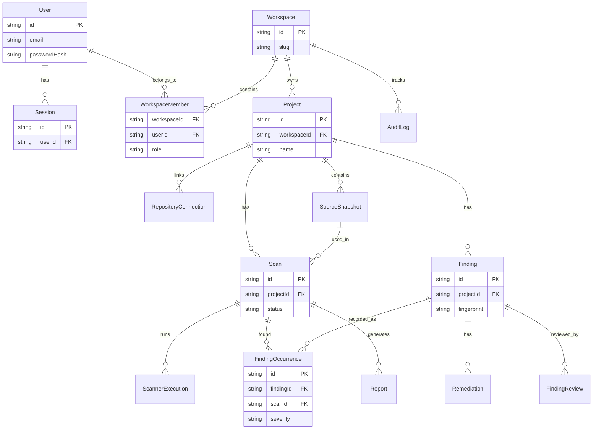

```mermaid
erDiagram
    User ||--o{ Session : has
    User ||--o{ WorkspaceMember : belongs_to
    Workspace ||--o{ WorkspaceMember : contains
    Workspace ||--o{ Project : owns
    Workspace ||--o{ AuditLog : tracks

    Project ||--o{ RepositoryConnection : links
    Project ||--o{ SourceSnapshot : contains
    Project ||--o{ Scan : has
    Project ||--o{ Finding : has

    SourceSnapshot ||--o{ Scan : used_in

    Scan ||--o{ ScannerExecution : runs
    Scan ||--o{ FindingOccurrence : found
    Scan ||--o{ Report : generates

    Finding ||--o{ FindingOccurrence : recorded_as
    Finding ||--o{ Remediation : has
    Finding ||--o{ FindingReview : reviewed_by

    User {
        string id PK
        string email
        string passwordHash
    }
    Session {
        string id PK
        string userId FK
    }
    Workspace {
        string id PK
        string slug
    }
    WorkspaceMember {
        string workspaceId FK
        string userId FK
        string role
    }
    Project {
        string id PK
        string workspaceId FK
        string name
    }
    Scan {
        string id PK
        string projectId FK
        string status
    }
    Finding {
        string id PK
        string projectId FK
        string fingerprint
    }
    FindingOccurrence {
        string id PK
        string findingId FK
        string scanId FK
        string severity
    }
```
